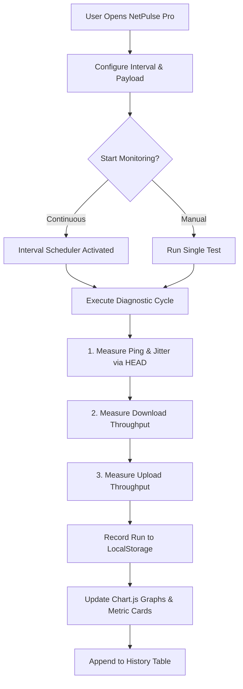

# NetPulse Pro ⚡
> **Enterprise Continuous Bandwidth & Latency Diagnostics**  
> Autonomous, client-side internet speed, jitter, and latency telemetry monitor with real-time time-series analytics and local persistence.

[](https://vercel.com/new/clone?repository-url=https%3A%2F%2Fgithub.com%2Ftheneotic%2Fnetpulse-pro)


---

## 🌟 Highlights

- ⏱️ **Continuous & Scheduled Testing**: Automated background runs with customizable intervals (`1m`, `5m`, `15m`, `30m`, `1h`) and manual *Run Test Now* triggers.
- 📊 **Real-Time Dynamic Visualizations**: Dual interactive Chart.js line charts tracking both Bandwidth Throughput (Download/Upload in Mbps) and Latency Performance (Ping/Jitter in ms) over the last 20 tests.
- 🎯 **High-Precision Diagnostic Engine**:
  - **Ping & Jitter**: Microsecond-precision round-trip time (RTT) calculated with cache-busted HTTP `HEAD` requests.
  - **Download Speed**: Multiplier-based chunked streaming through high-capacity CDN endpoints using `ReadableStream`.
  - **Upload Speed**: Cryptographically secure binary blob generation sent via asynchronous `POST` requests.
- 💾 **Local Data Persistence**: Saves complete telemetry logs in browser `localStorage` without tracking or server-side logging.
- 📤 **Instant Data Export**: One-click export to CSV for network auditing, ISP dispute documentation, and historical reports.
- 🎨 **Modern Cyber-Dark UI**: Glassmorphism aesthetic built with Tailwind CSS, glowing indicators, responsive progress bars, and Lucide icons.

---

## 🚀 One-Click Vercel Deployment

NetPulse Pro is fully configured for zero-configuration deployment on **Vercel** with optimized security headers (`vercel.json`).

### Deploy via Web UI:
1. Click the **Deploy with Vercel** button above or go to [Vercel Dashboard](https://vercel.com/new).
2. Import your repository: `theneotic/netpulse-pro`.
3. Keep default settings (Framework Preset: **Other**, Build Command: *empty*, Output Directory: *empty*).
4. Click **Deploy**. Your site will be live on a global edge CDN in seconds!

### Deploy via Vercel CLI:
```bash
# Install Vercel CLI if needed
npm install -g vercel

# Deploy directly from repository root
vercel
```

---

## 💻 Local Development

NetPulse Pro runs entirely in the browser without any build dependencies.

### Option 1: Direct Browser
Double-click `index.html` to open it in Chrome, Edge, Safari, or Firefox.

### Option 2: Local HTTP Server
```bash
# Using Node.js (via package.json script)
npm start

# Or using Python 3
python -m http.server 8080
```
Navigate to `http://localhost:8080`.

---

## 📐 Architecture & Workflow



---

## ⚙️ Configuration Options

| Setting | Options | Description |
| :--- | :--- | :--- |
| **Test Interval** | 1m, 5m (default), 15m, 30m, 1h | Frequency of automated diagnostic cycles |
| **Payload Size** | Light (~2MB), Standard (~10MB), Heavy (~30MB) | Volume of data transferred during throughput evaluation |

---

## 🤝 Multi-Agent Development

This repository was architected using a coordinated dual-agent workflow between **Cline** and **Roo Code**:
* **`.clinerules`**: Defines role boundaries, code standards, and UI/Engine separation.
* **`.roomodes`**: Custom architectural and auditing modes for Roo Code.
* **`COLLABORATION.md`**: Live task board for coordinating UI polish and engine extensions.

---

## 🔒 Privacy & Network Model

* **No Tracking**: NetPulse Pro does not collect personal information, user accounts, or cookies.
* **Client-Side Only**: All calculations and metrics are computed locally in the browser runtime.
* **Data Transparency**: Historical records never leave your device unless you export them to CSV.

---

## 📄 License

Distributed under the MIT License.
