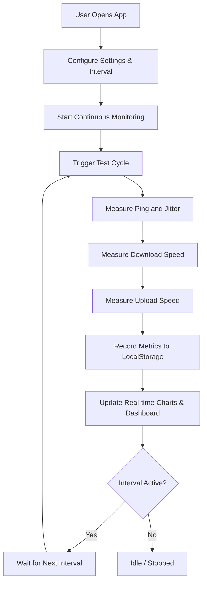

# Constant Internet Speed Testing Website - Architecture & Implementation Plan

## Overview
A lightweight, high-performance single-page application (SPA) running entirely client-side. It performs continuous, scheduled or manual internet speed tests (Download Speed, Upload Speed, Ping, and Jitter) using robust public CDN assets and fetch/XHR telemetry, rendering real-time performance graphs and maintaining persistent test history with CSV/JSON export capabilities.

---

## Architecture & Technology Stack

- **Frontend Framework**: Vanilla JavaScript (ES6+), HTML5, Tailwind CSS via CDN for styling.
- **Charts & Visualization**: Chart.js for real-time time-series graphing of bandwidth and latency.
- **Data Persistence**: Browser `localStorage` for historical test runs, metrics, and timestamps.
- **Speed Testing Engine**:
  - **Ping & Jitter**: Measuring round-trip time (RTT) via lightweight HEAD requests with cache-busting headers.
  - **Download Speed**: Fetching chunked/large binary test payloads from reliable CDN endpoints with precise timing.
  - **Upload Speed**: Sending generated Blob payloads via POST requests with performance monitoring.
- **Continuous Monitoring Scheduler**: Configurable timer intervals (e.g., every 1 min, 5 mins, 15 mins, 30 mins) with auto-start/stop controls.

---

## System Workflow & Mermaid Diagram

---

## File Structure

- `index.html`: Main UI layout containing dashboard cards, control panel, interval selector, and Chart.js canvases.
- `app.js`: Core speed testing logic, timer scheduler, telemetry calculations, and Chart.js rendering.
- `styles.css` (or Tailwind classes): Responsive styling, dark mode support, status indicators.
- `plans/speed-test-website-plan.md`: This comprehensive architecture plan.

---

## Action Plan Checklist

1. Define architecture and technical stack (Completed)
2. Design frontend UI/UX layout with real-time graphs and controls
3. Implement continuous speed test engine (Download, Upload, Ping, Jitter)
4. Implement history tracking, data persistence, and export functionality
5. Review and test the implementation plan
