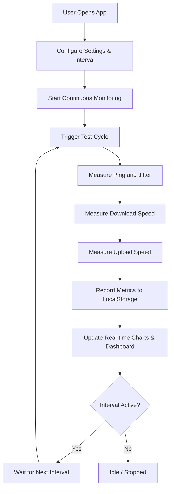

# Constant Internet Speed Testing Website - Architecture & Implementation Plan

## Overview
A lightweight, high-performance single-page application (SPA) running entirely client-side. It performs continuous, scheduled or manual internet speed tests (Download Speed, Upload Speed, Ping, and Jitter) using robust public CDN assets and fetch/XHR telemetry, rendering real-time performance graphs and maintaining persistent test history with CSV/JSON export capabilities.

---

## Architecture & Technology Stack

- **Frontend Framework**: Vanilla JavaScript (ES6+), HTML5, Tailwind CSS via CDN for styling.
- **Charts & Visualization**: Chart.js for real-time time-series graphing of bandwidth and latency.
- **Data Persistence**: Browser `localStorage` for historical test runs, metrics, and timestamps.
- **Speed Testing Engine**:
  - **Ping & Jitter**: Measuring round-trip time (RTT) via lightweight HEAD requests with cache-busting headers.
  - **Download Speed**: Fetching chunked/large binary test payloads from reliable CDN endpoints with precise timing.
  - **Upload Speed**: Sending generated Blob payloads via POST requests with performance monitoring.
- **Continuous Monitoring Scheduler**: Configurable timer intervals (e.g., every 1 min, 5 mins, 15 mins, 30 mins) with auto-start/stop controls.

---

## System Workflow & Mermaid Diagram

---

## File Structure

- `index.html`: Main UI layout containing dashboard cards, control panel, interval selector, and Chart.js canvases.
- `script.js`: Core speed testing logic, timer scheduler, telemetry calculations, and Chart.js rendering.
- `tests/engine.spec.js`: Node E2E harness against the live measurement endpoints.
- `tests/idcheck.js`: DOM contract test (ids referenced by `script.js` vs `index.html`).
- `plans/speed-test-website-plan.md`: This comprehensive architecture plan.

---

## Final Implementation Notes (2026-09-10 — status: COMPLETED ✅)

All checklist items below are implemented and verified. Key final decisions:

| Decision | Chosen approach |
| :--- | :--- |
| Measurement host | `https://speed.cloudflare.com` only — one TLS connection, CORS `*`, `no-store`. Same endpoints Cloudflare's own speed test uses. |
| Download | Streaming `GET /__down?bytes=N&cb=<nonce>`, bytes counted via `ReadableStream`. |
| Upload | `POST /__up` with crypto-random Blob (`application/octet-stream`). |
| Ping / jitter | 8 × `GET /__down?bytes=0&cb=<nonce>`; RTT = **median**, jitter = **mean abs successive diff** (RFC 3550). |
| Sizing | Adaptive: DL 2→10→25→50 MB, UL 1→2→5→10→20 MB, halt when a stage runs ≥ 1.5 s; slow-link fallbacks down to 256 KB / 64 KB. |
| Failures | Record `null` values + `Partial`/`Failed` status; Chart.js shows a gap. No random data anywhere in measurements. |
| Server badge | `cf-meta-*` headers → fallback `GET /cdn-cgi/trace` → "Mumbai, IN [BOM]". |
| Scheduling | Chained `setTimeout` (drift-free), queued tick if a test overruns, interval persisted in `localStorage`, countdown UI. |
| History | `netpulse_history` key, capped at 500 records. |
| Export | CSV + JSON via shared blob download helper. |

### Verification results (live)
- `node --check script.js` — clean.
- `node tests/engine.spec.js` — ping, jitter, download, upload, server-info all pass against the live Cloudflare edge.
- `node tests/idcheck.js` — all 25 referenced DOM ids present.
- `python -m http.server 8080` → `/index.html` and `/script.js` return HTTP 200.

---

## Action Plan Checklist

1. Define architecture and technical stack (Completed)
2. Design frontend UI/UX layout with real-time graphs and controls (Completed)
3. Implement continuous speed test engine (Download, Upload, Ping, Jitter) (Completed)
4. Implement history tracking, data persistence, and export functionality (Completed)
5. Review and test the implementation plan (Completed — see tests above)
